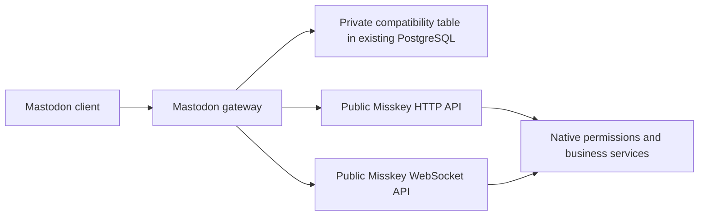

# Mastodon compatibility gateway

`packages/mastodon-compat` owns the Mastodon protocol. It is an independent workspace package and can run as a separate HTTP/WebSocket service. It accesses Misskey through its public HTTP API and streaming protocol; it does not import NestJS, TypeORM entities, repositories, native business services, or the internal event bus. There are no client-name or User-Agent branches.



## Installation and authorization

The normal Misskey build includes the workspace package. `enableMastodonApi` defaults to `true`; setting it to `false` disables the embedded gateway. Native OAuth and the native UI remain in use. The integration shares the original `/oauth/authorize` and `/oauth/token` paths by dispatching only gateway client IDs to the gateway. Native clients retain their original handlers.

Mastodon registration creates a gateway application. Authorization redirects to the normal MiAuth consent page with the required native permissions. A one-time callback exchanges the approved MiAuth session for a one-time OAuth code, then a compatibility bearer token. Native account master tokens are neither copied nor accepted as compatibility bearer tokens. Tokens granted to applications stay subject to native revocation, account restrictions, permissions, rate limits, and visibility rules.

**Existing compatibility clients must register and authorize again after this rewrite.** Their old credentials are not silently converted into a native application grant. Remove and re-add the account in clients that cache the old registration. The ordinary Misskey login and native application grants are unaffected.

PKCE S256 and registered custom-scheme redirects are supported. OOB redirects display an authorization code. `lang` is an optional hint; the MiAuth page uses native language settings. `force_login=true` is explicitly rejected because the unchanged native consent page cannot guarantee forced account selection.

## PostgreSQL state and deployment

The embedded gateway uses Misskey's existing `db` configuration and the primary PostgreSQL server. Its application registrations, hashed client secrets, hashed bearer tokens, native application grants, pending authorization state, filters, markers, and other metadata live in the dedicated `mastodon_compat_entry` table. No SQLite file, encryption-key file, or additional Docker volume is needed for normal operation. The independent package owns the SQL storage implementation and does not import native business repositories or services.

A new migration creates the table and its expiry index; run the normal Misskey migration before starting the updated server. The Docker image's existing `migrateandstart` command does this. Existing Compose configurations that already persist PostgreSQL need no extra compatibility mount. Back up the PostgreSQL database normally. Keep native application credentials private with the rest of that database.

This is a fresh compatibility store. Clients must register and authorize again; there is no SQLite import, legacy storage configuration, or credential conversion. After creating the new table, the migration deletes `mastodon_user_state`, `mastodon_oauth_token`, and `mastodon_oauth_client`, including their old data. Both an existing installation and a fresh installation finish with only the new compatibility table. The three historical migration files and their execution records are retained.

The new migration's `down()` restores the old tables, indexes, and foreign keys in their final form, including nullable `mastodon_oauth_token.userId` for application tokens, then removes the new table. It restores schema only: it cannot recover deleted legacy data or preserve new gateway data through rollback. Use a database backup to restore data when rolling back a deployment.

Multiple gateway processes and hosts can use the same primary database. Short database transactions serialize state changes, while one-time operation consumption is atomic. Native HTTP operations run outside those transactions. Database failure fails the operation; the gateway does not fall back to a new empty file or an in-memory registry.

## Standalone mode

```sh
pnpm --filter @pari/mastodon-compat build
MASTODON_PUBLIC_URL=https://social.example \
MISSKEY_NATIVE_URL=http://127.0.0.1:3000 \
MASTODON_DATABASE_URL="$MISSKEY_DATABASE_URL" \
pnpm --filter @pari/mastodon-compat start
```

Set `MISSKEY_DATABASE_URL` to the existing PostgreSQL connection URL and run the native migrations first.

The gateway listens on `127.0.0.1:3100` by default (`MASTODON_HOST` and `MASTODON_PORT` override it). A same-origin reverse proxy must route Mastodon API/streaming URLs and the compatibility OAuth requests to this service, and native API, `/miauth/`, UI resources, and ActivityPub URLs to Misskey. Avoid routing every `/api/` request to the gateway: native Misskey also uses that prefix. When native OAuth is needed on the same origin, use the embedded dispatcher or an equivalent explicit routing setup for the overlapping OAuth paths.

The standalone service uses real HTTP and WebSocket connections to the fixed native upstream. Embedded mode uses a small HTTP injection transport to preserve the actual caller IP for native rate limiting and still crosses the complete native API validation/authentication path. It does not call endpoint classes directly.

## Protocol coverage

| Area | Behavior |
| --- | --- |
| Encoding and errors | JSON, URL-encoded bracket parameters, and multipart forms; CORS; Mastodon-shaped errors; native rate-limit response headers. |
| OAuth | Registration, authorization code, PKCE, client-credentials token, own-client revoke, application verification, native grant revocation. |
| Accounts | Credential verification and updates, avatars/headers, lookup/search, relationships, following/followers, requests, blocks/mutes, lists. |
| Statuses | Creation, replies/direct recipients, quotes, deletion, editing and native revision history, context, favourites, bookmarks, boosts, pins, thread mute, public/home/tag/list timelines. |
| Media and polls | Native Drive uploads and ownership checks, descriptions and focus metadata, attached files, polls and atomic multi-choice voting. |
| Notifications | v1 notifications and v2 stable singleton groups, cross-page lookups, shared dismiss/clear state, and marker-based unread counts. |
| Discovery | Instance metadata/rules/peers, custom emoji, directory, suggestions, tags/trending notes, search via public native APIs. |
| User state | v1/v2 filters with keyword/status rules, reading markers, direct conversation read/hide state, preferences, announcements. |
| Streaming | User/status/notification, public/local/remote/media, hashtag and list subscriptions, full subscription identity, visible edits/deletes, direct conversations. |

Favourites map to heart reactions (`❤`/`❤️`). Creating a favourite returns a conflict if another reaction exists, and removing a favourite preserves a different native emoji. The native reaction endpoints expose optional conditional-write parameters; existing callers retain their previous defaults. The native poll endpoint accepts an optional `choices` array so one submitted ballot is one native transaction; existing `choice` requests still work.

Status language/sensitivity, attachment focus, OAuth state, filters, and markers live in the gateway store. Compatibility metadata does not add fields to native notes or change the federated ActivityPub representation. Native media descriptions still use the native Drive update semantics. A sensitive compatibility status does not rewrite a shared file's sensitivity.

`quote_approval_policy: public` is accepted for ordinary posts and quotes. For private/direct posts, all three standard policy values are accepted because native visibility already prevents other users from quoting them. Restrictive `followers`/`nobody` policies on public or unlisted posts are rejected because the native server cannot enforce them. Both `quoted_status_id` and the compatibility alias `quote_id` create a native quote; supplying different IDs in both fields returns 422. Quotes without a comment use the quoted post's canonical URL as visible fallback text. Native visibility, block and channel checks still apply. Editing quote text is supported, but changing the quoted target is not.

## Explicit limits

This is a practical compatibility implementation, not a claim of complete Mastodon 4.6 conformance. Unsupported writes return errors rather than reporting that work was performed.

- Push delivery and scheduled publishing are not implemented by this gateway. Existing native Misskey push/scheduled-note features keep their own behavior.
- Poll editing, custom replacement thumbnails, restrictive quote approval for public/unlisted posts, and Mastodon Collections are not implemented. Native quotes do not implement Mastodon's cross-server quote approval and revocation protocol.
- Conversation discovery scans at most the latest 1,000 native entries per incoming/outgoing source. It does not provide a full historical conversation index.
- Reply context traversal returns at most 100 visible descendants and performs at most 200 native child-page reads.
- Remote search, translation, public timelines and uploads remain subject to native server configuration, connectivity, and permissions.
- Node.js must satisfy the repository's engine range.

## Verification

The independent package contains real HTTP and WebSocket transport tests, OAuth/state persistence tests, serializer/security regression cases, and route contract tests. `packages/backend/test/e2e/mastodon-api.ts` exercises the gateway against an actual Misskey service, PostgreSQL, and Redis, including MiAuth authorization, JSON/form/multipart publishing, concurrent idempotency, both pagination directions, media uploads, visibility, reactions, polls, lists, notifications, revocation, and streaming. It also checks authorization persistence across a standalone gateway restart and embedded shutdown with an active stream. The native test host recreates its PostgreSQL schema on restart, so its reset endpoint cannot establish native credential persistence.

```sh
pnpm --filter @pari/mastodon-compat test
pnpm --filter backend test:e2e --run test/e2e/mastodon-api.ts
pnpm build-misskey-js-with-types
node scripts/check-shipping.mjs --base HEAD
```

The e2e suite needs the standard ignored `.config/test.yml` and test PostgreSQL/Redis instances. Passing protocol tests does not establish that every third-party application's UI has been exercised. Client UI and live federation acceptance remain separate checks.

For PostgreSQL-backed gateway tests, set `MASTODON_TEST_DATABASE_URL` to a dedicated test database. The tests create isolated schemas using the three historical compatibility migrations followed by the new migration, and remove those schemas afterward. With no test URL, PostgreSQL-specific cases are explicitly skipped; protocol tests use an explicitly constructed in-memory adapter.

Local validation on 2026-09-12:

| Check | Result |
| --- | --- |
| Gateway protocol, HTTP/WebSocket, memory and real PostgreSQL storage tests | PASS: 123 tests, no skips |
| Real Misskey HTTP/WebSocket with PostgreSQL and Redis | PASS: 15 e2e tests |
| Gateway and backend TypeScript; production backend build | PASS |
| New migration up/down/up and actual migration-created table vs entity schema | PASS: zero pending DDL |
| Historical application-token migration unit test | PASS: 1 test |
| Changed-file lint, SPDX and locale safety | PASS |
| Deployed migrations and original native business implementations | Unchanged |
| Actual Docker image rebuild and individual third-party client UI | Not executed |

The PostgreSQL HTTP lifecycle test starts separate gateway processes, forcibly terminates them, and removes their entire writable directories. Registered clients, pending consent, one-time codes, grants, and revocations survive without a shared file directory. Additional tests cover transaction rollback and isolation, once-only consumption, and reconnecting after an idle PostgreSQL connection is terminated.

Migration regressions cover an empty compatibility migration history and a populated legacy database. They compare rollback columns, indexes, and foreign keys with the actual historical migration result, verify that deleted credentials are not restored, and check that an external dependency blocking the last table deletion rolls back the entire transaction. The retired entities and repository registrations are removed so schema checks do not propose recreating the old tables.

Quote alias regressions cover `quote_id` in JSON, URL-encoded forms, and multipart requests, confirm the persisted native `renoteId` and quote response, and check bare quotes, idempotency, conflicting aliases, and hidden-target rejection before publishing.

The native e2e harness retains its existing controller-server exit warning (`close timed out after 10000ms`); all 15 tests pass and the runner exits with code 0. This warning is separate from the active-stream gateway shutdown tests.

Changelog candidate: Fix: Accept quote_id when creating native Misskey quotes through the Mastodon API.

References: [Mastodon API guidelines](https://docs.joinmastodon.org/api/guidelines/), [OAuth](https://docs.joinmastodon.org/methods/oauth/), [Mastodon entities](https://docs.joinmastodon.org/entities/), [MiAuth](https://misskey-hub.net/en/docs/for-developers/api/token/miauth/). The package follows the HTTP-adapter architecture used by Megalodon; it is implemented against the current public native APIs rather than importing an obsolete Misskey SDK or native backend internals.
