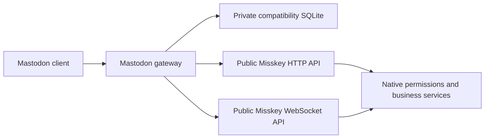

# Mastodon compatibility gateway

`packages/mastodon-compat` owns the Mastodon protocol. It is an independent workspace package and can run as a separate HTTP/WebSocket service. It accesses Misskey through its public HTTP API and streaming protocol; it does not import NestJS, TypeORM entities, repositories, native business services, or the internal event bus. There are no client-name or User-Agent branches.



## Installation and authorization

The normal Misskey build includes the workspace package. `enableMastodonApi` defaults to `true`; setting it to `false` disables the embedded gateway. Native OAuth and the native UI remain in use. The integration shares the original `/oauth/authorize` and `/oauth/token` paths by dispatching only gateway client IDs to the gateway. Native clients retain their original handlers.

Mastodon registration creates a gateway application. Authorization redirects to the normal MiAuth consent page with the required native permissions. A one-time callback exchanges the approved MiAuth session for a one-time OAuth code, then a compatibility bearer token. Native account master tokens are neither copied nor accepted as compatibility bearer tokens. Tokens granted to applications stay subject to native revocation, account restrictions, permissions, rate limits, and visibility rules.

**Existing compatibility clients must register and authorize again after this rewrite.** Their old credentials are not silently converted into a native application grant. Remove and re-add the account in clients that cache the old registration. The ordinary Misskey login and native application grants are unaffected.

PKCE S256 and registered custom-scheme redirects are supported. OOB redirects display an authorization code. `lang` is an optional hint; the MiAuth page uses native language settings. `force_login=true` is explicitly rejected because the unchanged native consent page cannot guarantee forced account selection.

## Private state and rollback

The gateway keeps its own SQLite database, defaulting to `.mastodon-compat/compat.sqlite` in the installation directory. Configure an absolute private location when deploying:

```yaml
enableMastodonApi: true
mastodonApiStoragePath: /var/lib/misskey-mastodon/compat.sqlite
```

Mount that directory as a persistent writable volume in containers. Do not place it under the public Drive/file directory. Back up the SQLite database and adjacent `compat.sqlite.key` together, with writes stopped or a consistent SQLite backup. Restoring the database without its encryption key cannot recover native grants. Files are restricted to their owner; bearer/client credentials are hashed, and native grants and pending authorization payloads are encrypted with AES-256-GCM.

### Docker / Compose upgrades

The default image path is `/misskey/.mastodon-compat/compat.sqlite`. `compose_example.yml` now mounts a named volume at its parent directory. Existing installations must also add this to their actual Compose file, preserving their other mounts:

```yaml
services:
  web:
    volumes:
      - mastodon_compat:/misskey/.mastodon-compat
volumes:
  mastodon_compat:
```

This mount uses the default storage path. If `mastodonApiStoragePath` points elsewhere, mount its parent directory instead. Keep the Compose project name stable so upgrades select the same named volume. The image creates the directory with mode `0700`, owned by its `misskey` user (UID/GID `991:991` by default). Bind mounts need matching ownership on the host.

The image also declares `VOLUME`, but this alone does not ensure that later containers reuse the same anonymous volume. Explicitly configure the persistent mount. An image update does not edit an existing Compose file or migrate the previous container's writable layer. See [Docker volume lifecycle and Compose mounts](https://docs.docker.com/engine/storage/volumes/).

Earlier gateway images did not declare or mount this directory. Replacing such a container loses application registrations, tokens, filters, markers, and other compatibility metadata stored in its writable layer. Cached client IDs then fail with `invalid_client` / `Unknown application`; existing bearer tokens also stop working. Native Misskey accounts and posts remain in PostgreSQL.

If the old container or a complete backup remains, recover the state **before** creating an empty replacement store:

1. Stop the old web container without removing it. Stop all processes writing the same compatibility database.
2. Copy its complete `/misskey/.mastodon-compat` directory, including `compat.sqlite`, `compat.sqlite.key`, and any `-wal` / `-shm` files, into a new private host directory. `docker cp` works with stopped containers; do not copy just the main database file or mix files from different backups.
3. Bind-mount that recovered directory at `/misskey/.mastodon-compat`, replacing the named-volume line above. Set ownership to the image's UID/GID and keep the directory private. Retain the original backup separately.
4. Start the replacement web service and verify that the old client can authorize and its existing token can verify credentials. Remove the old container only after recovery is confirmed.

If both the old directory and its backups are gone, the server cannot reconstruct the lost secrets, encryption key, or application registrations. Configure persistence first, then have each client or API integration register a new application and authorize again. Removing an account or clearing browser data does not necessarily clear a client platform's server-side application cache. For example, [Elk stores its application registration on its own server](https://github.com/elk-zone/elk/blob/main/server/utils/shared.ts); its operator may need to invalidate a stale registration when the original store cannot be restored.

The gateway uses SQLite WAL and synchronous transactions for authorization/state changes. Processes on one host can share the same local SQLite database. A deployment across multiple hosts should route the compatibility service to one persistent gateway instance; a network filesystem is not a substitute for a shared database service.

This rewrite adds **no PostgreSQL migration**. The three previously deployed compatibility migrations, tables, and entity schema declarations remain as legacy data. They are not used by the new runtime. Retaining them avoids modifying deployed migration history, avoids implicit schema drops, and allows rollback to the previous release. A rollback must restore the previous application build as well as its matching configuration; it does not migrate new SQLite state back into the old tables.

## Standalone mode

```sh
pnpm --filter @pari/mastodon-compat build
MASTODON_PUBLIC_URL=https://social.example \
MISSKEY_NATIVE_URL=http://127.0.0.1:3000 \
MASTODON_DATABASE=/var/lib/misskey-mastodon/compat.sqlite \
pnpm --filter @pari/mastodon-compat start
```

The gateway listens on `127.0.0.1:3100` by default (`MASTODON_HOST` and `MASTODON_PORT` override it). A same-origin reverse proxy must route Mastodon API/streaming URLs and the compatibility OAuth requests to this service, and native API, `/miauth/`, UI resources, and ActivityPub URLs to Misskey. Avoid routing every `/api/` request to the gateway: native Misskey also uses that prefix. When native OAuth is needed on the same origin, use the embedded dispatcher or an equivalent explicit routing setup for the overlapping OAuth paths.

The standalone service uses real HTTP and WebSocket connections to the fixed native upstream. Embedded mode uses a small HTTP injection transport to preserve the actual caller IP for native rate limiting and still crosses the complete native API validation/authentication path. It does not call endpoint classes directly.

## Protocol coverage

| Area | Behavior |
| --- | --- |
| Encoding and errors | JSON, URL-encoded bracket parameters, and multipart forms; CORS; Mastodon-shaped errors; native rate-limit response headers. |
| OAuth | Registration, authorization code, PKCE, client-credentials token, own-client revoke, application verification, native grant revocation. |
| Accounts | Credential verification and updates, avatars/headers, lookup/search, relationships, following/followers, requests, blocks/mutes, lists. |
| Statuses | Creation, replies/direct recipients, quotes, deletion, editing and native revision history, context, favourites, bookmarks, boosts, pins, thread mute, public/home/tag/list timelines. |
| Media and polls | Native Drive uploads and ownership checks, descriptions and focus metadata, attached files, polls and atomic multi-choice voting. |
| Notifications | v1 notifications and v2 stable singleton groups, cross-page lookups, shared dismiss/clear state, and marker-based unread counts. |
| Discovery | Instance metadata/rules/peers, custom emoji, directory, suggestions, tags/trending notes, search via public native APIs. |
| User state | v1/v2 filters with keyword/status rules, reading markers, direct conversation read/hide state, preferences, announcements. |
| Streaming | User/status/notification, public/local/remote/media, hashtag and list subscriptions, full subscription identity, visible edits/deletes, direct conversations. |

Favourites map to heart reactions (`❤`/`❤️`). Creating a favourite returns a conflict if another reaction exists, and removing a favourite preserves a different native emoji. The native reaction endpoints expose optional conditional-write parameters; existing callers retain their previous defaults. The native poll endpoint accepts an optional `choices` array so one submitted ballot is one native transaction; existing `choice` requests still work.

Status language/sensitivity, attachment focus, OAuth state, filters, and markers live in the gateway store. Compatibility metadata does not add fields to native notes or change the federated ActivityPub representation. Native media descriptions still use the native Drive update semantics. A sensitive compatibility status does not rewrite a shared file's sensitivity.

`quote_approval_policy: public` is accepted for ordinary posts and quotes. For private/direct posts, all three standard policy values are accepted because native visibility already prevents other users from quoting them. Restrictive `followers`/`nobody` policies on public or unlisted posts are rejected because the native server cannot enforce them. `quoted_status_id` creates a native quote; quotes without a comment use the quoted post's canonical URL as visible fallback text. Native visibility, block and channel checks still apply.

## Explicit limits

This is a practical compatibility implementation, not a claim of complete Mastodon 4.6 conformance. Unsupported writes return errors rather than reporting that work was performed.

- Push delivery and scheduled publishing are not implemented by this gateway. Existing native Misskey push/scheduled-note features keep their own behavior.
- Poll editing, custom replacement thumbnails, restrictive quote approval for public/unlisted posts, and Mastodon Collections are not implemented. Native quotes do not implement Mastodon's cross-server quote approval and revocation protocol.
- Conversation discovery scans at most the latest 1,000 native entries per incoming/outgoing source. It does not provide a full historical conversation index.
- Reply context traversal returns at most 100 visible descendants and performs at most 200 native child-page reads.
- Remote search, translation, public timelines and uploads remain subject to native server configuration, connectivity, and permissions.
- Node.js must satisfy the repository's engine range, including the built-in `node:sqlite` module.

## Verification

The independent package contains real HTTP and WebSocket transport tests, OAuth/state persistence tests, serializer/security regression cases, and route contract tests. `packages/backend/test/e2e/mastodon-api.ts` exercises the gateway against an actual Misskey service, PostgreSQL, and Redis, including MiAuth authorization, JSON/form/multipart publishing, concurrent idempotency, both pagination directions, media uploads, visibility, reactions, polls, lists, notifications, revocation, and streaming. It also checks authorization persistence across a standalone gateway restart and embedded shutdown with an active stream. The native test host recreates its PostgreSQL schema on restart, so its reset endpoint cannot establish native credential persistence.

```sh
pnpm --filter @pari/mastodon-compat test
pnpm --filter backend test:e2e --run test/e2e/mastodon-api.ts
pnpm build-misskey-js-with-types
node scripts/check-shipping.mjs --base HEAD
```

The e2e suite needs the standard ignored `.config/test.yml` and test PostgreSQL/Redis instances. Passing protocol tests does not establish that every third-party application's UI has been exercised. Client UI and live federation acceptance remain separate checks.

Local rewrite validation on 2026-09-12:

| Check | Result |
| --- | --- |
| Gateway protocol, transport, persistence and lifecycle tests | PASS: 97 tests |
| Real Misskey HTTP/WebSocket with PostgreSQL and Redis | PASS: 12 e2e tests |
| Native reaction, poll, OAuth, token, report, push and scheduled-note regressions | PASS: 39 tests in 8 suites |
| Gateway/backend TypeScript and generated `misskey-js` API types | PASS |
| Changed-file lint, SPDX and locale safety | PASS |
| Native entities and deployed migrations | Unchanged; no PostgreSQL migration added |
| Docker image and individual third-party client UI | Not executed |

The native e2e harness retains its existing controller-server exit warning (`close timed out after 10000ms`); all 12 assertions pass and the runner exits with code 0. This warning is separate from the active-stream gateway shutdown tests.

The quote-policy follow-up on 2026-09-12 passed 102 gateway tests and 13 real-service e2e tests, including ordinary posts with `quote_approval_policy`, quoted posts, empty-comment quotes, quoting boosts, clearing quote comments, and native visibility restrictions. Changed-file lint, TypeScript, SPDX and locale safety also passed; the existing e2e exit warning remains.

The Docker persistence follow-up on 2026-09-12 passed 104 gateway tests, TypeScript, changed-file lint, SPDX, locale safety, and Compose YAML validation. Two new tests make real HTTP OAuth requests to separate gateway processes, forcibly terminate them, and replace their writable directories. An unmounted directory reproduces `Unknown application` and invalid tokens; a shared persistent directory preserves registrations, pending consent, single-use codes, encrypted grants, and revocation. The mount is modeled using a local symlink; an actual Docker rebuild was not run because no Docker daemon is available. Native business code and migrations are unchanged.

Changelog candidate: Fix: Preserve Mastodon application registrations and authorization across Docker container replacement.

References: [Mastodon API guidelines](https://docs.joinmastodon.org/api/guidelines/), [OAuth](https://docs.joinmastodon.org/methods/oauth/), [Mastodon entities](https://docs.joinmastodon.org/entities/), [MiAuth](https://misskey-hub.net/en/docs/for-developers/api/token/miauth/). The package follows the HTTP-adapter architecture used by Megalodon; it is implemented against the current public native APIs rather than importing an obsolete Misskey SDK or native backend internals.
